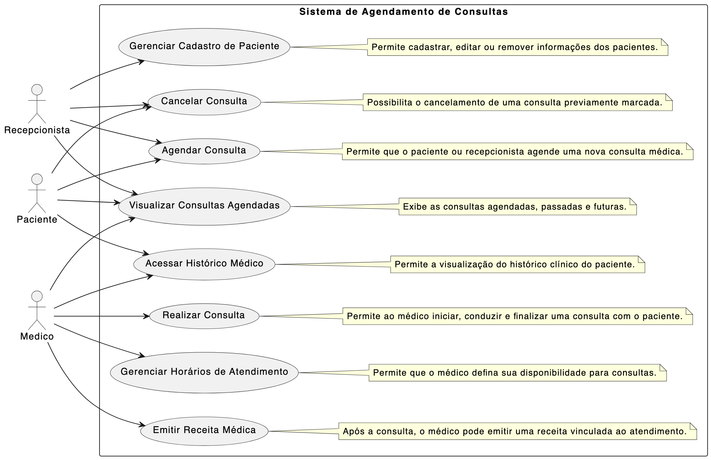
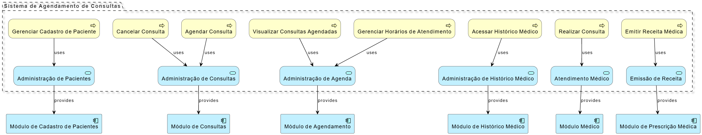
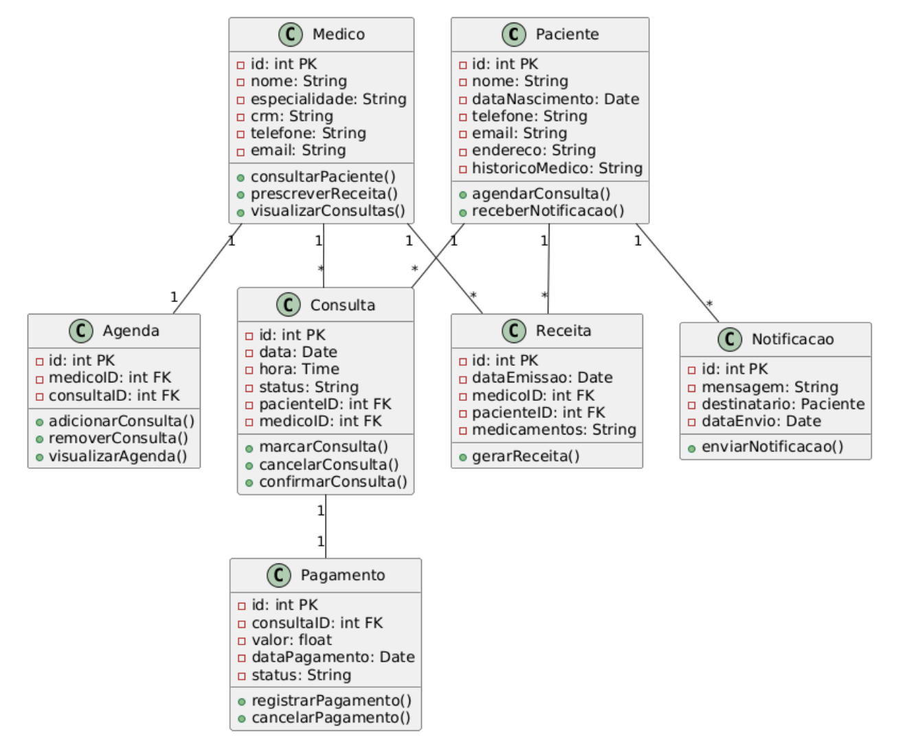
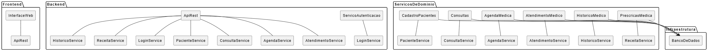
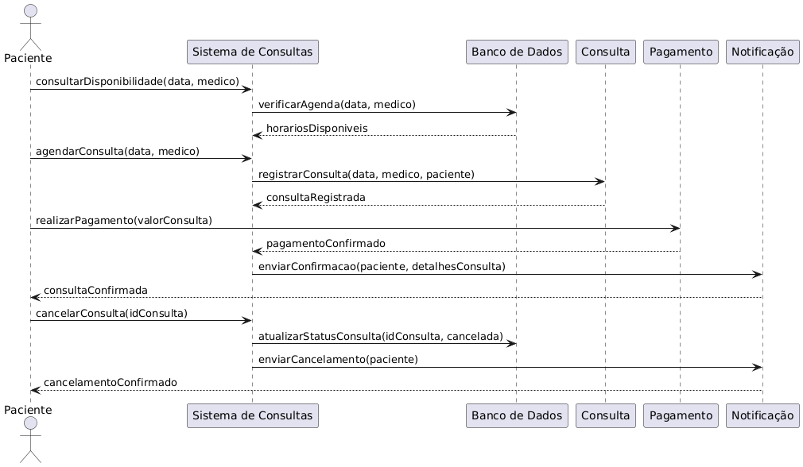
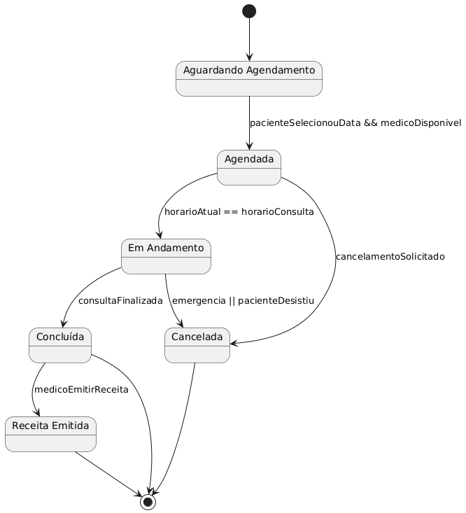
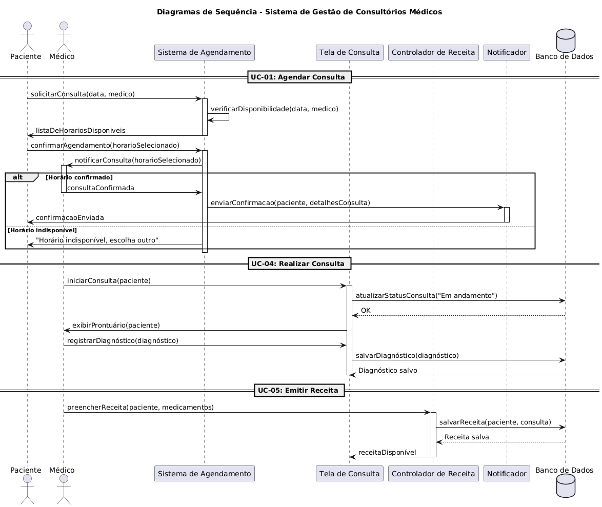

# Sistema de Gestão de Consultórios Médicos
Projeto de sistema elaborado pelo(s) aluno(s) Lucas Porto e Gustavo Comam como parte da disciplina Projeto de Software.

### Contextualização do Sistema
O objetivo é facilitar o agendamento de consultas, o gerenciamento do histórico médico dos pacientes e o acompanhamento de receitas e prescrições médicas. Esse sistema visa otimizar a comunicação entre médicos, pacientes e recepcionistas, melhorando a eficiência no atendimento e reduzindo o tempo de espera.
O projeto incluirá a entrega dos seguintes diagramas: 
* Diagrama de Caso de uso;
* Diagrama de Classe;
* Diagrama de Componentes e Implantação;
* Diagramas de Sequência;
* Diagramas de Comunicação;
* Diagramas de Estados.

## Diagrama de Caso de Uso

 

## Diagrama de Arquitetura

 

## Diagrama de Classe

 

## Diagrama de Componente

 

## Diagrama de Comunicacao

 

## Diagrama de Estado

 

## Diagrama de Sequencia

 

## Links de cada diagrama

- Link Diagrama de Sequencia - //www.plantuml.com/plantuml/png/VLJ1QXin4BthAmQV78YXXVQou99uDxHGx1hR_O29DB47j98hoQRqRqfFBVIKJ_2FTRMMPIqDkQqrxyrxypJodG_emg7L8d3G10tZrc6B7XJ1chuTJd-CP8G9hDa7QZ6UVoGVJhzi_AojyGSTJi-EhOVvwRTYQRqGA8Dri4J9P081UbYciuI9HtEnHnTOyXvDW56XSBybex3jk7OKaUlx8NH36Wjvx46RUWZgYi5PZSgwY5sH94xGUZM0BcpW9vOH6QiBeJ3W8tg2qGoDx2TjkghloSrCYEaKljQJDs-hPDLbAp2TYYLCFdIUA_1Mi-I0xb8Tnywtq5BCu2P6maSC50TStrzOHtAz7TUmtrl3ZwnPeQ8XEH6M5MZs0HlwP1t6QqYi8x4NYag9gp5fpHEx5bsHz7XtRh0cJPAjGVMYmta59kMLntgTEXUe0tJsJZyxJDPMLiopdzIeljImj3vFqeiAo1mPtGKcqOxtQSbkGL50lID_SLLOM8X52ajUgG-nLrBAEDAUhbxPg3xDqzyZwMlYevS1jq1UMhr3i8VWx6Wu0narl8-yHkygM15g_Z7SetCycxe2DYpv6dUUkPYms_vD7V7Dh08CXtExTUW-VUQD7bh0_B9kH3E3IPBuyZdnvnNGTtvajtJMX4C_PY6OFJdQiWykRYbkpUdP1vPsh8eVDuKZZ_huAhImKg9weYrown0vj_SLFBGSs5qUTmwjNbMmTqH6xiYbOXuYFQ5p2hx8i5w9UZLm_3ythsgs7BKIx4oAJN98_NbJB96YKa_SaL7n__SV
- Link Diagrama de Comunicacao - //www.plantuml.com/plantuml/png/ZLHDpjem5Dpx51Oh8eKBT57HbdM5oWcczWEUbDYHRRBeTRhu3iB5FkF43lduWPqzpBoPDrXP-m0NJcqZe89rSWl5P0A9BiAik8C9Sh5Z7wY5r2H_MUDFJO1VI7Wv_b30kUmdZB8NqGRQ3e84fUkScYSaKhxCALiSqCPiDd7ARKxwRGFlMU7ySVu_43EYO8N8wydLzvliyfjKuzbjs7VMy5zkM4FJKYEWbYrfLhOIDyeuRLeipkd99K_tuq16uulyYhgwd-De7HnRFyReYVtBx4XMBaDlHCwNA7PqY0JtG5xBRlIkH16jdbVuPvoeCKzU_hVaYeR_mHLisQEn9KCb9l83jouJ8hXdrq9RSM_NwrSGPMHwXikQY2tpWhNK5D0SoKyf9ksGewmpRLliyVgDmIXghffcNQnUloo4qz3PBiIZlpEapWuQrVjL94cgSkhY-UPPCIz_JKPVlYQV
- Link Diagrama de Estado - //www.plantuml.com/plantuml/png/TL91JiCm4Bpx5QiUYeJK3o0LDIBb0VI8EApifQnaUwl4ve3w9Lx1nzYahfDKS4fcTcQSyMRN9-nI3jxSGKll70a44fy4785ZF7OO4Ao4aI1LE-cDFXB1gZbcx1n69z0SAJeC59Ei07kOHhD9zOsKmukoWEjm7w1PHEr3Snlm9D7w_FDT8YwGfumNiiG9rSg9YwXmXQf962rvB9gAZ7czVuFDvl6V8kPFUZ3KFl009xIiF1t8asM9abjC2Eir179ifUN-994_oPlgqeXvOqtva0uxbYPbzB3TNh6MxhDFQEPgTK-teLvRHCySqVCNEboUL0iFsilx67GGpvQ7PI_YRoqKgDCuomZdSwtRKizzucocBr7ZSW7gBfSmuguCZPchYb5NOUgfbQdXbTbfiU5F_WK0
